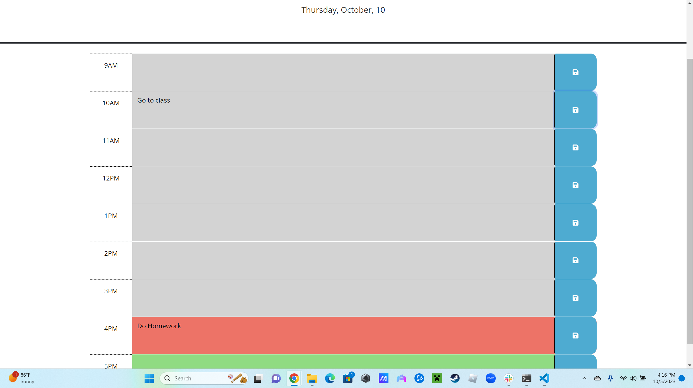

# using-web-apis-challenge-5

## Description
This project was my bootcamp's 5th homework assignment and since it ws odd we were given a starting off point. For my bootcamp odd homework assignments usually meant we had an hmtl css and javascript files already made to add on to. In this project we were told to use Web APIs to make an office hours calendar that saves plans to the local storage. The APIs used in this project were Bootstrap, Dayjs, and Jquery.

## Website

Link: https://ezekiel186.github.io/using-web-apis-challenge-5/

## Usage
This website can be used to track your plans by the hour. All you need to do is type out what your plan is for that hour and save it using the button on the right. Gray blocks mean that those hours have passed, red blocks signify the current hour, and green represents the hours to come. 

## Credits

Github:https://github.com/Ezekiel186 Linkedin:https://www.linkedin.com/in/ezekiel-jamolin-747150291/